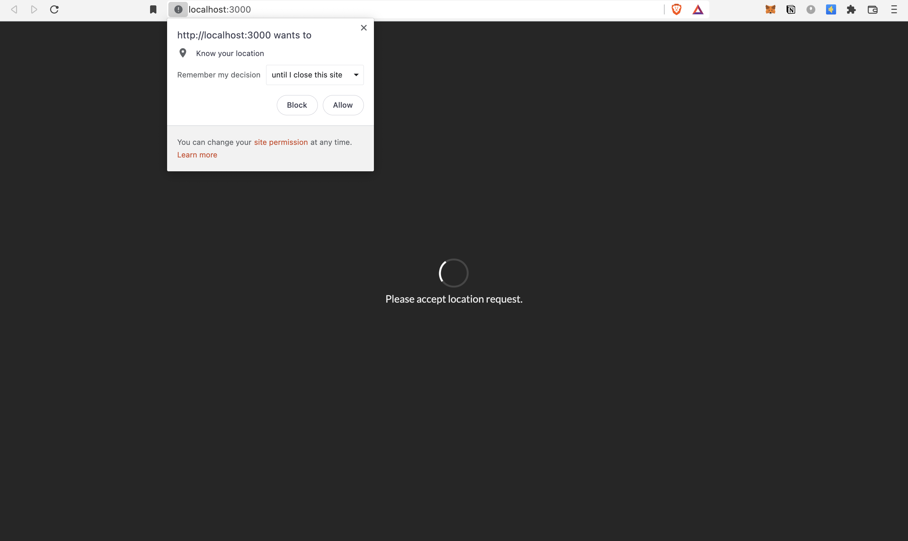
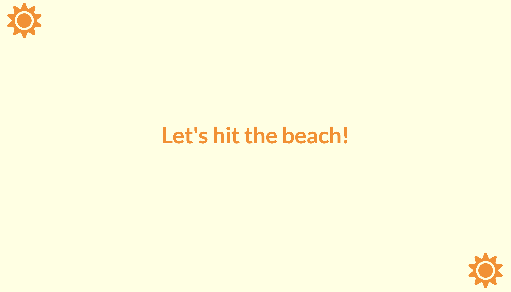
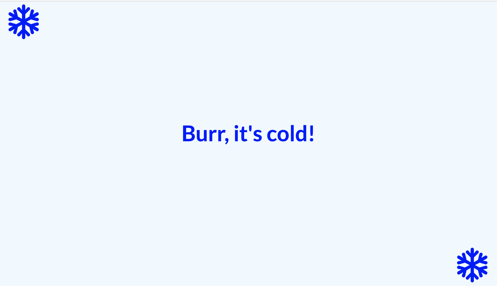

# Seasons App

## What is it ?

* This is a simple React project which shows the ongoing season depending on the location and month of the year, of a user. 
* The UI consists of first of all a loading screen where, the user is asked about giving the location permission.
* If the user gives the permission, then using the Geolocation API we are able to get the latitude coordinate of the user. 
* Using this, we show if it's Winter (Shows the message 'Burr, it's cold!') or Summer (Showing the message 'Let's hit the beach!'). 
* If the user doesn't give the permission, corresponding error message is displayed.
* Used Class Components and understood how advantages of using Class Components over Functional Components.
* Understood the concept of state, how state is modified & different lifecycle methods of a 
class component. Also understood why we should declare default props values.
* It uses the Semantic-UI for the styling purposes.

## App Screenshots
 
|  |
| :----------------------------------------: |
|      **Figure 1: Loading Screen**     |

|  |
| :----------------------------------------: |
|      **Figure 2: Summer Season**     |

|  |
| :----------------------------------------: |
|      **Figure 3: Winter Season**     |
